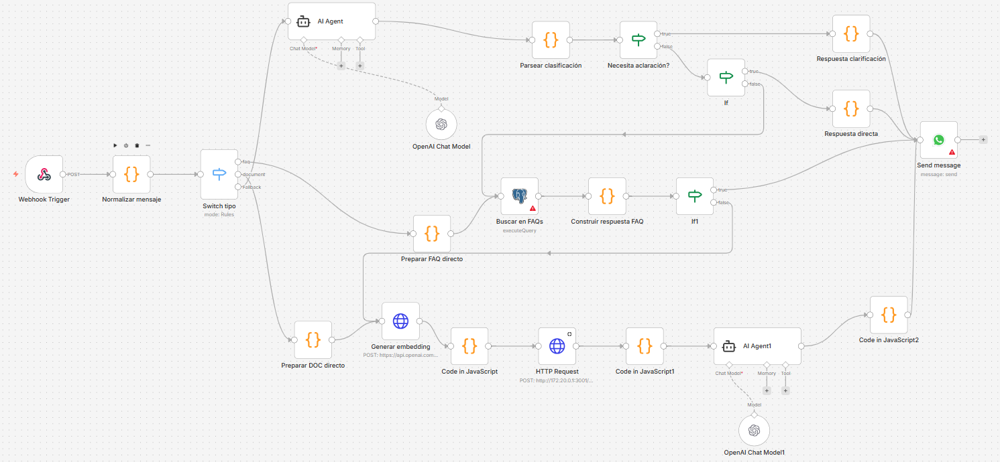

# Chatbot FCE - Automatización con n8n

## Descripción de proyecto

Chatbot FCE es una herramienta de chat para los estudiantes de la Facultad de Ciencias Económicas (UNCUYO). A través de ella se pueden hacer consultas académicas/administrativas y obtener respuestas automatizadas rápidamente. La herramienta también es capaz de determinar cuando la situación requiere de intervención humana y derivar el caso a quien corresponda.

El canal de comunicación entre los usuarios y Chatbot FCE es WhatsApp, que se conecta a n8n a través de WhatsApp Cloud API.

## Configuración inicial

- Servidor n8n: contamos con una instancia de n8n dockerizada en un servidor propio
- WhatsApp Cloud API: la configuración requiere de algunos pasos
    - Crear un portfolio de negocios en Facebook
    - Acceder a developers.facebook.com y crear una app
    - Configurar nuestra cuenta de WhatsApp Business API con número y token de autenticación

## Workflows

### Flujo principal

El flujo principal recibe mensajes de WhatsApp vía webhook, los clasifica y los resuelve por distintos caminos según su tipo.

1. **Webhook Trigger** — Recibe el POST entrante desde WhatsApp Cloud API.
2. **Normalizar mensaje** — Transforma el payload crudo en una estructura estandarizada (remitente, texto, metadatos).
3. **Switch tipo** — Enruta el mensaje según su naturaleza usando reglas:
   - **`faq`** → rama de preguntas frecuentes
   - **`document`** → rama de consulta sobre documentos
   - **`fallback`** → rama de agente IA general

---

#### Rama FAQ

4. **Preparar FAQ directo** — Arma la query a ejecutar contra la base de datos.
5. **Buscar en FAQs** (`executeQuery`) — Consulta PostgreSQL buscando la FAQ más relevante.
6. **Construir respuesta FAQ** — Formatea el resultado de la query en texto legible.
7. **If1** — Verifica si se encontró un resultado válido:
   - `true` → envía la respuesta directamente a **Send message**
   - `false` → deriva al agente IA (ver rama fallback)

---

#### Rama Document (búsqueda semántica)

4. **Preparar DOC directo** — Prepara el texto de la consulta para vectorización.
5. **Generar embedding** (`POST https://api.openai.com/...`) — Llama a la API de OpenAI para obtener el vector embedding del mensaje.
6. **Code in JavaScript** — Procesa y formatea el embedding resultante.
7. **HTTP Request** (`POST http://172.20.0.1:3001/...`) — Consulta el servicio local de búsqueda vectorial con el embedding generado.
8. **Code in JavaScript1** — Extrae y rankea los fragmentos de documentos más similares.
9. **AI Agent1** (con **OpenAI Chat Model1**) — Genera una respuesta en lenguaje natural basándose en los fragmentos recuperados.
10. **Code in JavaScript2** — Post-procesa la respuesta del agente antes de enviarla.

---

#### Rama Fallback (agente IA general)

4. **AI Agent** (con **OpenAI Chat Model**, memoria y herramientas) — Procesa el mensaje con un agente conversacional que mantiene contexto de sesión.
5. **Parsear clasificación** — Extrae del output del agente la clasificación de intención estructurada en JSON.
6. **Necesita aclaración?** — Evalúa si el agente requiere más información del usuario:
   - `true` → **Respuesta clarificación** genera un mensaje pidiendo datos adicionales
   - `false` → continúa al siguiente condicional
7. **If** — Determina si hay una respuesta directa disponible:
   - `true` → **Respuesta directa** formatea la respuesta final
   - `false` → redirige a la rama FAQ para intentar resolver con la base de datos

---

#### Salida unificada

Todos los caminos convergen en **Send message**, que envía la respuesta final al usuario a través de WhatsApp Cloud API.

> Desarrollo en progreso, la diagramación del flujo todavía no está terminada.